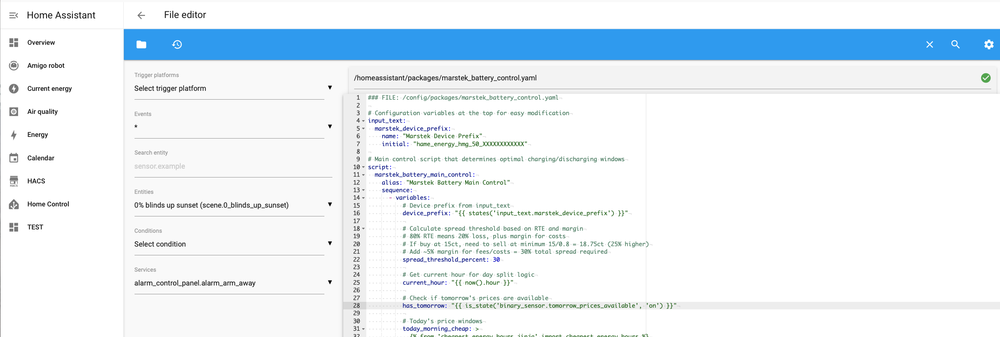
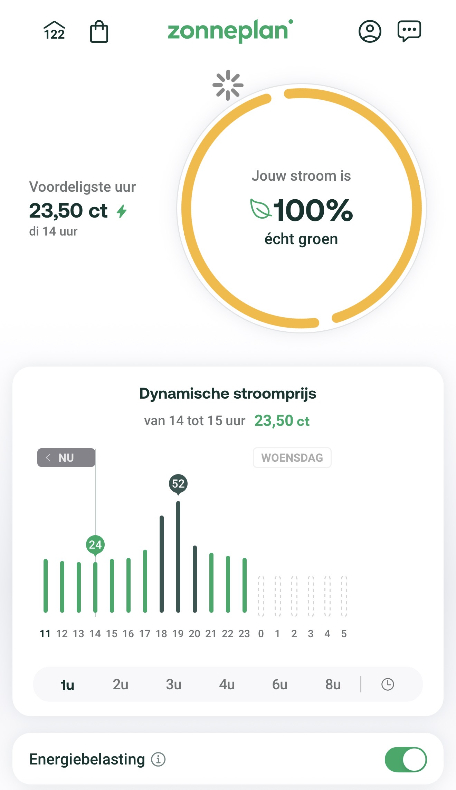
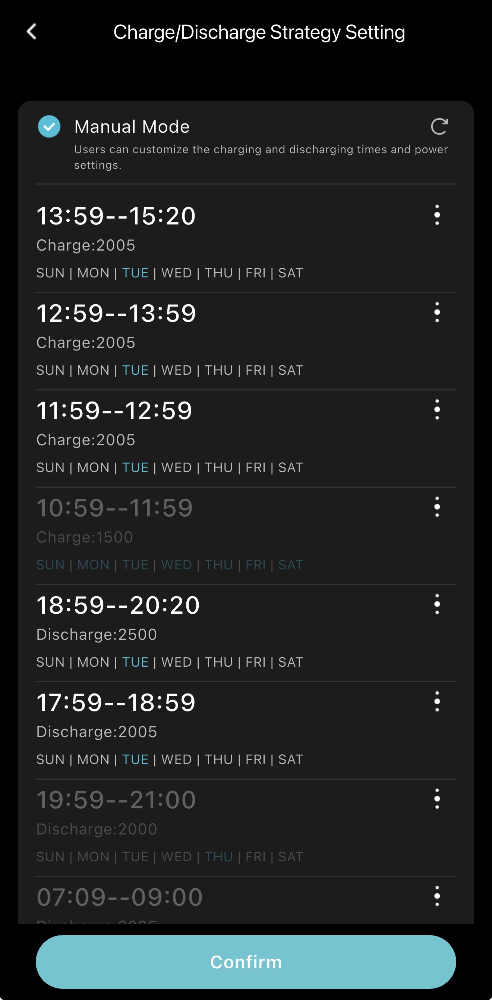
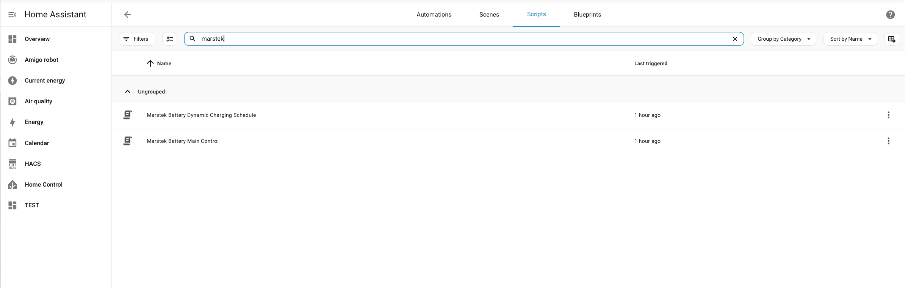

## HA: Smart Arbitrage Charging for Marstek (Duravolt) Venus-E


Home Assistant script that processes dynamic electricity tariffs to plan manual charging on cheapest and manual discharging on expensive hours.

**Important note:** This code is still a proof-of-concept of the purpose of learning to control the Venus-E. Use at own risk, the only purpose is for personal study and beta testing and currently one Venus-E plug-in battery is supported.

## Prerequisites: 
- Only communicates with a MT (Marstek/Duravolt) Venus-E **v2.0**
- Minimum version of Home Assistant: 2025.9.1
- [Home Assistant Community Store](https://hacs.xyz/docs/use/download/prerequisites/) integration installed on HA
- [MQ Telemetry Transport](https://www.home-assistant.io/integrations/mqtt) (MQTT) integration installed on HA 
- [Hame Relay](https://github.com/tomquist/hame-relay) 1.2.0 or higher

Optionally:
- [Home Assistant File editor](https://github.com/home-assistant/addons/tree/master/configurator#home-assistant-add-on-file-editor) (for editing files directly on HA)
- Enabling 'advanced mode' for your user in HA

## Loading the Venus-E arbitrage charging script

If not set-up already, setup in `/homeassistant/configuration.yaml` the following lines to load packages from `./packages` directory:

```yaml
homeassistant:
  packages: !include_dir_named packages
```

The smart charging scripts and entities will be created by copying the [marstek_battery_control.yaml](home-assistant/config/packages/marstek_battery_control.yaml) YAML to `/homeassistant/packages/marstek_battery_control.yaml` on HA.



## Configuration

### Dynamic prices tarrifs
```yaml
sensor='sensor.zonneplan_current_electricity_tariff',
```
Currently the YAML config is set to retrieve dynamnic tarrifs from the HA entity: `sensor.zonneplan_current_electricity_tariff`



The script plans the (dis)charging accordingly



### Venus-E entity ID
```yaml
input_text:
  marstek_device_prefix:
    name: "Marstek Device Prefix"
    initial: "<YOUR_MQTT_ENTITY_ID_IN_HOME_ASSISTANT>"
```
After Hame Relay has been installed and configured for the MT battery, the HA [entity ID created by MQTT](http://homeassistant.local:8123/config/devices/dashboard?historyBack=1&domain=mqtt) needs to be filled in [marstek_battery_control.yaml](home-assistant/config/packages/marstek_battery_control.yaml) under `marstek_device_prefix`:

### Smart charging scheduling
```yaml
automation:
  - id: marstek_daily_control_trigger
    alias: "Marstek Battery Daily Control midnight"
    trigger:
      - platform: time
        at: "00:30:00"
    action:
      - service: script.marstek_battery_main_control
  - id: marstek_daily_control_trigger
    alias: "Marstek Battery Daily Control morning"
    trigger:
      - platform: time
        at: "10:30:00"
    action:
      - service: script.marstek_battery_main_control
```
The automation part of the YAML config contains automatic execution of the smart charging scheduling

### Discharging speeds
```yaml
spread_threshold_percent:
[...]

cheap_hours_count:
[...]

discharging_speeds:
[...]
```
These three variable work together into determining whether the script (dis)charges the battery today (`spread_threshold_percent`) and what speed it (dis)charges (`cheap_hours_count`, `discharging_speeds`). 

### Dashboard
```yaml
input_datetime:
  first_charge_hour_start:
    name: "Marstek Battery First Charge Hour Start Time"
    has_date: true
    has_time: true

  last_charge_hour_start:
    name: "Marstek Battery Last Charge Hour Start Time"
    has_date: true
    has_time: true

  first_discharge_hour_start:
    name: "Marstek Battery First Discharge Hour Start Time"
    has_date: true
    has_time: true

  last_discharge_hour_start:
    name: "Marstek Battery Last Discharge Hour Start Time"
    has_date: true
    has_time: true
```
To keep track of the scheduling four entities are created for making the schedule visible in any custom HA dashboard

## Manual running script

After reloading the HA configuration (Developer Tools > Check And Restart > Restart) the YAML config in this repository creates two scripts. To avoid confusion of the two scripts `Marstek Battery Main Control` handled the planning, using the second script to separate the MQTT logic. This has been separated to avoid issues and ensure Marstek reliably receives the complete manual schedule.
